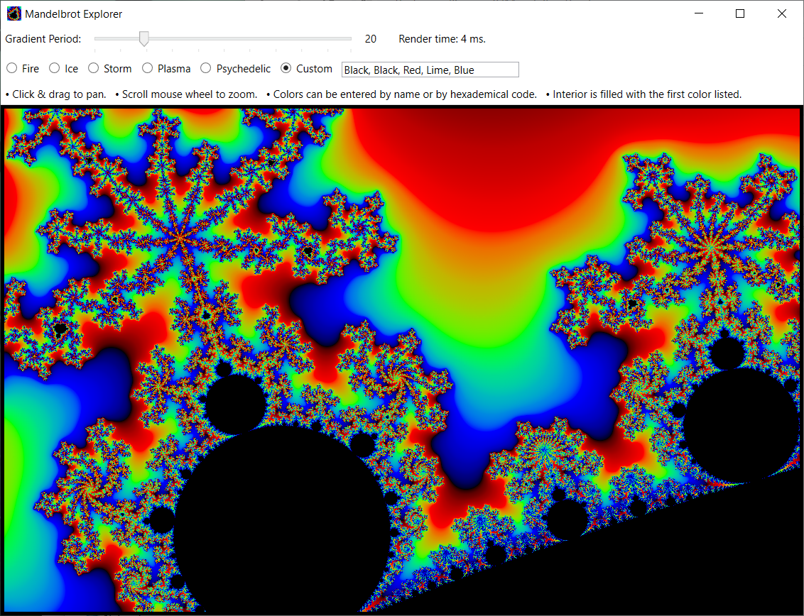

# Mandelbrot Explorer

An easy, fast, Vulkan-powered Mandelbrot fractal renderer.

## Version 1.0.0

Known Issues:

Limited zoom capability due to use of low 32-bit float precision in the GLSL fragment shader. Switching to 64-bit significantly increases rendering time, thereby causing Windows TDR (Timeout Detection & Recovery) to restart the graphics driver and interrupt the rendering process.

A future version of Mandelbrot Explorer will spread the rendering over several frames so that no single frame will invoke TDR. This should allow for longer-running high precision algorithms and, hence, deeper zoom capability.

